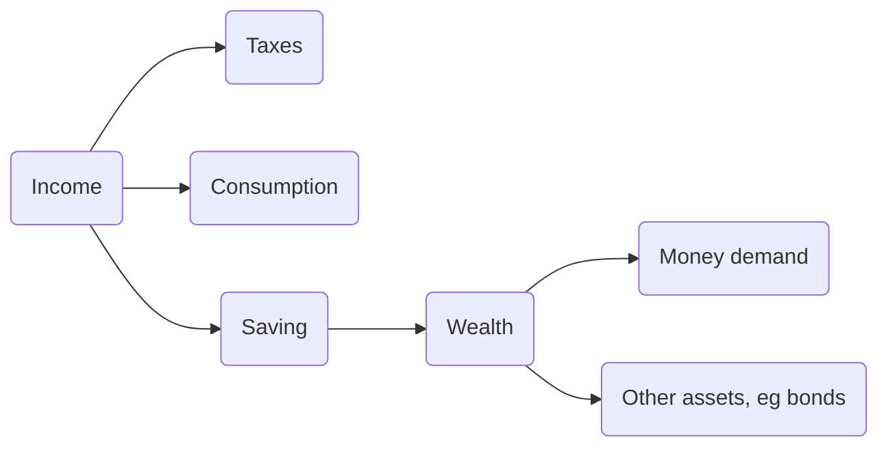

- [[Money]] and other financial assets
- [[Interest Rate]]
- central banks and commercial banks
	- each country has their own central bank
	- e.g. [[FED]] in US
	- e.g. [[ECB]] in

## Household Decisions

## Fiscal Policy
- issued by government
- levels of government spending and taxes
	- also where the spending and taxing is happening

## Monetary Policy
- issued by central bank
- changes in money supply
	- setting [[Interest Rate]] for a region

# Market Operations
## Money Demand
- the amount of money people want to hold, aggregated
	- in personal finance: non-dispensable income
- dependent on income and [[Interest Rate]]
	- $M^{d} = M^{d}(Y, i)$

## Money Supply
- decided by central bank
- equilibrium = $M^{s} = M^{d}$
- therefore -> $M^{s} = Y * L(i)$

## Open Market Operations
- buying/selling own bonds
- increase money supply: expansionary open market operation
	- lower [[Interest Rate]]
	- buying of own bonds -> [[Share Buyback]], reducing available bonds
	- $\uparrow T$ and/or $\downarrow G$ -> $\downarrow Z$ -> $\downarrow Y$ -> $\downarrow C,I$ -> loop
		- government budget credit -> lower [[GDP]]
- decrease money supply: consolidation/contractionary open market operation
	- higher [[Interest Rate]]
	- selling of own bonds -> issuing additional bonds
	- $\uparrow G$ and/or $\downarrow T$ -> $\uparrow Z$ -> $\uparrow Y$ -> $\uparrow C,I$ -> loop
		- government budget debt -> higher [[GDP]]
- no "setting" of [[interest rate]]
	- just selling/buying enough bonds to adjust interest rate accordingly
- interest rate increases when income $Y$ increases
- interest rate decrease when money supply $M^{s}$ increases

# Fischer Equation
$$r = i - \pi^e$$
$r$ ... real interest rate
$i$ ... nominal interest rate
$\pi^e$ ... expected inflation

## Negative Real Interest
- $i$ can never be less than 0 -> lower bound
- $r$ can only ever be negative (deflation) when $i < \pi^e$

## Financial Crisis
- risk premium $x$ ... #todo 
- response: fiscal policy and monetary rate

# Unconventional Methods
- qualitative easing
- quantitative easing
	- buying bonds -> more money in the economy
	- selling bonds -> less money in the economy

# Where does money come from
### Central Banks
- assets
	- bonds ([[#Open Market Operations]])
- liabilities
	- central bank money (H)
	- currency (CU)
	- [[Federal Reserves|reserves]] (R)
	- **NO EQUITY**
	
### Commercial Bank
- assets
	- loans
	- bonds
	- reserve at central bank
- liabilities
	- checkable deposits
	- equity

### Money Multiplier
![[money_multiplier.png]]
