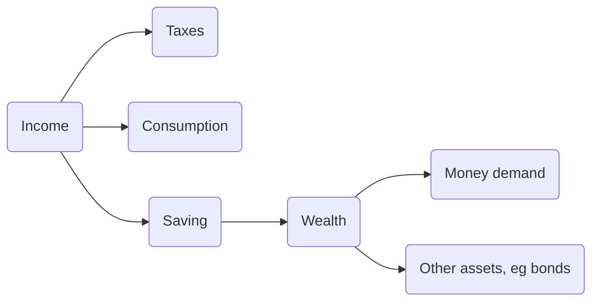

- [[Money]] and other financial assets
- [[Interest Rate]]
- central banks and commercial banks
	- each country has their own central bank
	- e.g. [[FED]] in US
	- e.g. [[ECB]] in

## Household Decisions

## Money Demand
- the amount of money people want to hold, aggregated
	- in personal finance: non-dispensable income
- dependent on income and [[Interest Rate]]
	- $M^{d} = M^{d}(Y, i)$

## Money Supply
- decided by central bank
- equilibrium = $M^{s} = M^{d}$
- therefore -> $M^{s} = Y * L(i)$

- increase money supply: expansionary open market operation
	- buying of bonds
- decrease money supply: 

## Fiscal Policy
- issued by government
- levels of government spending and taxes
	- also where the spending and taxing is happening

## Monetary Policy
- issued by central bank
- changes in money supply
	- setting [[Interest Rate]] for a region